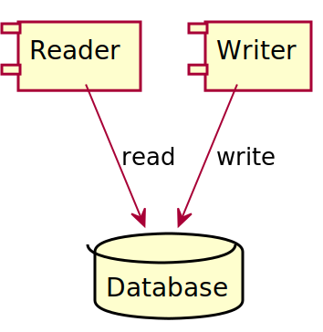
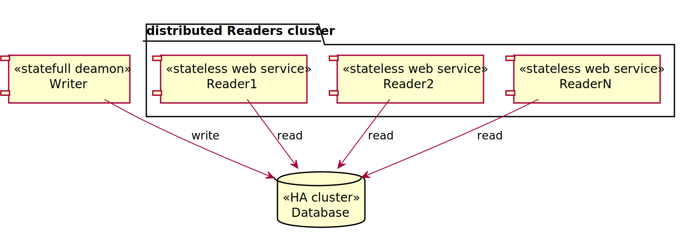
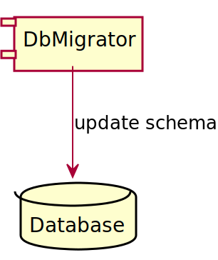
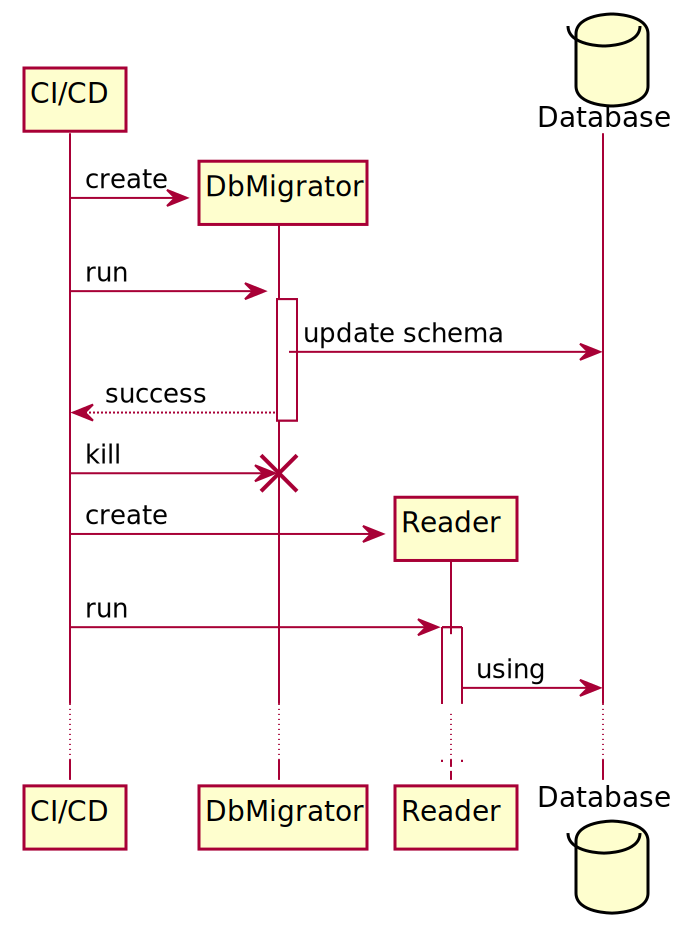
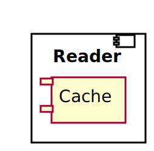
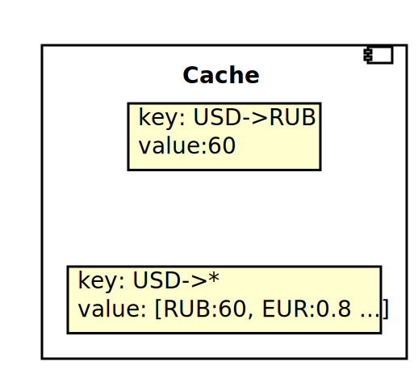
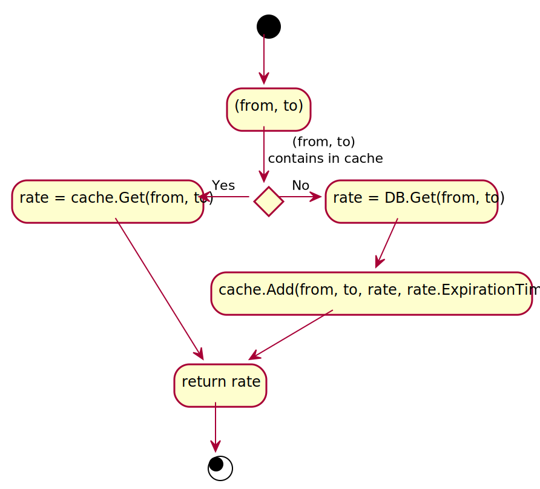
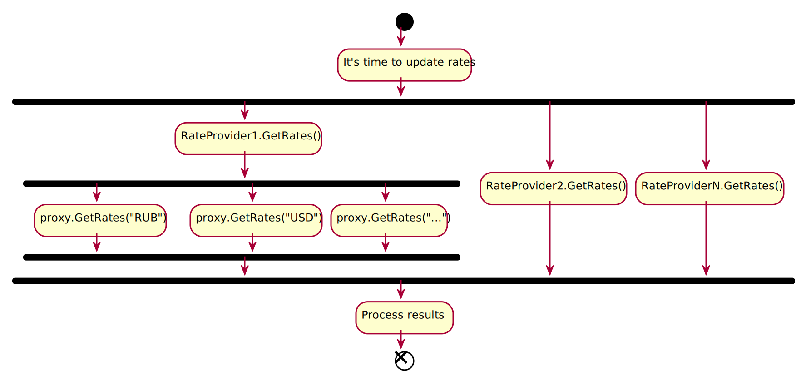
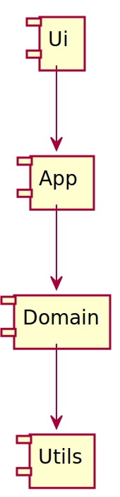
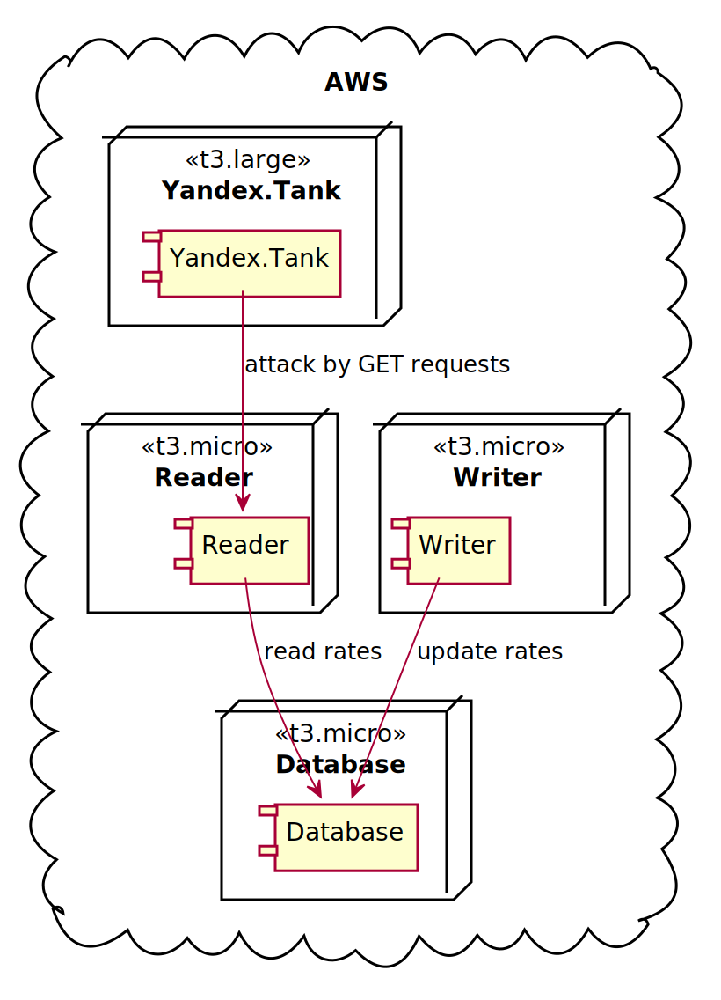

# EasyRates


## Содержание <!-- omit in toc -->

- [Задание](#%d0%97%d0%b0%d0%b4%d0%b0%d0%bd%d0%b8%d0%b5)
  - [End point](#end-point)
  - [Усложнение](#%d0%a3%d1%81%d0%bb%d0%be%d0%b6%d0%bd%d0%b5%d0%bd%d0%b8%d0%b5)
- [Решение](#%d0%a0%d0%b5%d1%88%d0%b5%d0%bd%d0%b8%d0%b5)
  - [Основная идея](#%d0%9e%d1%81%d0%bd%d0%be%d0%b2%d0%bd%d0%b0%d1%8f-%d0%b8%d0%b4%d0%b5%d1%8f)
  - [БД](#%d0%91%d0%94)
    - [Схема](#%d0%a1%d1%85%d0%b5%d0%bc%d0%b0)
    - [Мигратор](#%d0%9c%d0%b8%d0%b3%d1%80%d0%b0%d1%82%d0%be%d1%80)
  - [Reader](#reader)
    - [Кэш](#%d0%9a%d1%8d%d1%88)
  - [Writer](#writer)
    - [Writer определяет ExpirationTime](#writer-%d0%be%d0%bf%d1%80%d0%b5%d0%b4%d0%b5%d0%bb%d1%8f%d0%b5%d1%82-expirationtime)
    - [Поддержка нескольких поставщиков курсов](#%d0%9f%d0%be%d0%b4%d0%b4%d0%b5%d1%80%d0%b6%d0%ba%d0%b0-%d0%bd%d0%b5%d1%81%d0%ba%d0%be%d0%bb%d1%8c%d0%ba%d0%b8%d1%85-%d0%bf%d0%be%d1%81%d1%82%d0%b0%d0%b2%d1%89%d0%b8%d0%ba%d0%be%d0%b2-%d0%ba%d1%83%d1%80%d1%81%d0%be%d0%b2)
    - [Независимые операции I/O запускаются асинхронно](#%d0%9d%d0%b5%d0%b7%d0%b0%d0%b2%d0%b8%d1%81%d0%b8%d0%bc%d1%8b%d0%b5-%d0%be%d0%bf%d0%b5%d1%80%d0%b0%d1%86%d0%b8%d0%b8-io-%d0%b7%d0%b0%d0%bf%d1%83%d1%81%d0%ba%d0%b0%d1%8e%d1%82%d1%81%d1%8f-%d0%b0%d1%81%d0%b8%d0%bd%d1%85%d1%80%d0%be%d0%bd%d0%bd%d0%be)
    - [Гибкая настройка времени обновления](#%d0%93%d0%b8%d0%b1%d0%ba%d0%b0%d1%8f-%d0%bd%d0%b0%d1%81%d1%82%d1%80%d0%be%d0%b9%d0%ba%d0%b0-%d0%b2%d1%80%d0%b5%d0%bc%d0%b5%d0%bd%d0%b8-%d0%be%d0%b1%d0%bd%d0%be%d0%b2%d0%bb%d0%b5%d0%bd%d0%b8%d1%8f)
  - [Логическая архитектура приложения](#%d0%9b%d0%be%d0%b3%d0%b8%d1%87%d0%b5%d1%81%d0%ba%d0%b0%d1%8f-%d0%b0%d1%80%d1%85%d0%b8%d1%82%d0%b5%d0%ba%d1%82%d1%83%d1%80%d0%b0-%d0%bf%d1%80%d0%b8%d0%bb%d0%be%d0%b6%d0%b5%d0%bd%d0%b8%d1%8f)
  - [Джентльменский набор](#%d0%94%d0%b6%d0%b5%d0%bd%d1%82%d0%bb%d1%8c%d0%bc%d0%b5%d0%bd%d1%81%d0%ba%d0%b8%d0%b9-%d0%bd%d0%b0%d0%b1%d0%be%d1%80)
- [Тестирование](#%d0%a2%d0%b5%d1%81%d1%82%d0%b8%d1%80%d0%be%d0%b2%d0%b0%d0%bd%d0%b8%d0%b5)
  - [Модульное](#%d0%9c%d0%be%d0%b4%d1%83%d0%bb%d1%8c%d0%bd%d0%be%d0%b5)
  - [Нагрузочное](#%d0%9d%d0%b0%d0%b3%d1%80%d1%83%d0%b7%d0%be%d1%87%d0%bd%d0%be%d0%b5)
- [Continuous integration](#continuous-integration)
- [Развертывание](#%d0%a0%d0%b0%d0%b7%d0%b2%d0%b5%d1%80%d1%82%d1%8b%d0%b2%d0%b0%d0%bd%d0%b8%d0%b5)
  - [Локально](#%d0%9b%d0%be%d0%ba%d0%b0%d0%bb%d1%8c%d0%bd%d0%be)

## Задание

Финансовой системе для проведения платежей необходимо знать с каким курсом их
проводить. Необходимо написать REST сервис, который позволит получать актуальные
курсы валют из собственного хранилища. При этом ответственность сервиса инвалидировать
свой кэш каждые n минут и хранить историю запрошенных у источника курсов. В качестве
источника курсов можно (но не обязательно) использовать <https://openexchangerates.org.>
У ресурса есть условия для бесплатного использования.

### End point

GET /rates/{from}/{to} - Получить курс обмена валют из сервиса.

При запросе GET /rates покупаемая валюта {to} может отсутствовать, в этом случае
необходимо вернуть все возможные валюты относительно продаваемой валюты {from}.

### Усложнение

- Получение и хранение курсов из нескольких источников с сохранением имени провайдера

- Сервис должен корректно отдавать котировки при 100 запросах в секунду, процент
ошибок (не 200 статусов) при получении котировок должен быть не более 1% в час

- Развертывание сервиса на нескольких серверах

## Решение

### Основная идея

Предлагается разделить систему на 3 части:

1. Reader. Сервис для получения текущих курсов валют.
2. Writer. Приложение для обновления текущих курсов валют.
3. Database. БД для хранения текущих курсов валют и истории.



Это желательно сделать, т.к. каждая из частей имеет свой жизненный цикл,
профиль нагрузки и требования к масштабируемости и надежности:

1. Reader - stateless веб сервис обрабатывающий http запросы в большом
количестве, работает только на чтение, взаимодействует только с Database.
Должен легко горизонтально масштабироваться, не требуется высокая надежность
каждого отдельного экземпляра (т.к. легко обеспечивается избыточность благодаря
горизонтальному масштабированию).
2. Writer - statefull приложение-daemon со сложной многопоточной логикой,
внешние запросы не обрабатывает, нагрузка низкая, взаимодействует со множеством
внешних систем. Горизонтальное масштабирование затруднено и не требуется,
желательна достаточно высокая надежность и доступность, требуется поддержка
простой и быстрой процедуры failover.
3. Database - хранилище данных, нагрузка низкая. Горизонтальное масштабирование
не требуется, требуется высокая надежность и доступность.



Кроме того, разделение на независимые части позволит по отдельности их разрабатывать,
развертывать и масштабировать.

### БД

#### Схема

Предлагается хранить актуальные курсы валют и историю отдельно (в разных
таблицах). Смысл очевиден: таблица с актуальными курсами будет значительно
меньше по размеру, чем таблица с историей, т.о. скорость доступа к актуальным
курсам будет выше.


#### Мигратор

Мигратор - приложение, которое идемпотентно обновляет схему базы данных до
нужной версии.



Наличие такого приложения очень удобно при развертывании системы в различных
окружениях(локально, на тестовом стенде, в боевом окружении). Общий алгоритм:

- Запустить Мигратор.
- Дождаться успешного завершения.
- Запустить сервис работающий с БД.



В kubernetes, например, Мигратор можно использовать как initContainer.

### Reader

#### Кэш

Основная особенность реализации Reader - это наличие кеша актуальных курсов
валют в памяти.



Особенности работы кэша:

1. Кэш хранит актуальный курс до времени истечения актуальности курса (rate.ExpirationTime).
2. Кэш хранит результаты запросов вида Валюта-->Все Доступные, единым элементом кэша.



Т.о. алгоритм обработки запроса на получение текущих курсов выглядит следующим образом.



### Writer

#### Writer определяет ExpirationTime

За ExpirationTime будем брать время следующего обновления курса.
WriterApp отвечает за обновление курсов валют, а значит знает, когда будет
следующее обновление, а значит именно ему определять ExpirationTime.

#### Поддержка нескольких поставщиков курсов

Writer поддерживает несколько поставщиков курсов (RateProvider).

При настройке приложения админ устанавливает приоритетность каждого
RateProvider, который будет использоваться.

Приоритетность влияет на то, курс какого RateProvider попадет в актуальные
курсы, если из разных RateProvider получены курсы для одних и тех же валют.
В актуальные курсы попадет курс из более приоритетного RateProvider.

#### Независимые операции I/O запускаются асинхронно

Writer обращается ко всем RateProvider асинхронно, после этого ждет когда все
RateProvider вернут запрошенные данные, после этого обрабатывает результаты.
Аналогично происходят запросы внутри RateProvider для каждой интересующей валюты.



Смысл очевиден: время выполнения обновления всех курсов со всех источников для
асинхронного варианта будет значительно меньше, чем для синхронного.

Если общее число запросов для обновления всех курсов со всех источников = n,
то общее время обновления всех курсов для синхронного и асинхронного вариантов будет:

<!-- https://alexanderrodin.com/github-latex-markdown/ -->

- 

- 

#### Гибкая настройка времени обновления

Для расчета плана времени обновлений используются 2 параметра:

- AnchorTime - время в сутках, которое точно должно попасть в план.
- Period - период обновления.

Например, если AnchorTime=04 часа, Period=9 часов, то итоговый план будет
выглядеть [04, 13, 22].

Это сделано для того, чтобы Writer получал актуальные значения курсов сразу, как
только они обновились в источнике.

Например, если мы знаем, что OpenExchange обновляет курсы 1 раз в час с
привязкой к круглым часам (т.е. в 7, в 8 и т.д.). То нам нужно задать
AnchorTime=00:00:00 и Period=01:00:00.

### Логическая архитектура приложения

Приложение разделено на классические слои:

- UI - пользовательского интерфейса, не обязательно графического. Проекты:
  - EasyRates.ReaderApp.AspNet
  - EasyRates.WriterApp.AspNet
- App - уровень приложения. Проекты:
  - EasyRates.ReaderApp
  - EasyRates.WriterApp
- Domain - бизнес логики приложения. Проекты:
  - EasyRates.Model
  - EasyRates.Model.Ef
  - EasyRates.Reader
  - EasyRates.Reader.Ef.Pg
  - EasyRates.Writer
  - EasyRates.Writer.Ef.Pg
  - ...
- Utils - уровень служебных классов, общих для различных приложений. Представлены
зависимостями от nuget пакетов:
  - Serilog...
  - Npgsql.EntityFrameworkCore.PostgreSQL
  - Amursoft.DbMigrator
  - ...



Зависимости между уровнями подчиняются “правилу зависимостей” (нижние уровни,
не должны ссылаться на верхние).

### Джентльменский набор

Reader, как любой уважающий себя сервис, поддерживает:

- Версионирование API.
- HealthCheck.
- Генерацию описания своего API в формате OpenApi.
- Автоматическую генерацию typescript и С# клиентского кода.
- Аутентификацию и авторизацию.
- Развертывание как докер-контейнер.

Writer, как более скромное, но все же уважающее себя демон-приложение,
поддерживает:

- HealthCheck.
- Развертывание как докер-контейнер.

## Тестирование

### Модульное

Среднее покрытие системы модульными тестами - 73%.

### Нагрузочное

Целью нагрузочного тестирования было - определить пропускную способность одного
экземпляра Reader.

Тестовый стенд выглядел следующим образом:



Все сервисы приложения запускались на самых слабых из доступных виртуальных
машинах AWS(t3.micro).

С подробными результатами можно ознакомиться [здесь](<https://clck.ru/MzhWV>).
На вкладке Monitoring можно посмотреть как "чувствовали" себя участвующие в
тесте машины (Reader, Writer, Database) с точки зрения использования CPU,
Memory и т.д.

Выводы:

- До нагрузки в 940 rps включительно наблюдается стабильная производительность.
100% запросов успешно обрабатываются. Характерное время ответа по 100
процентилю 25 мс, при выбросах 250 мс.
- На диапазоне нагрузок 940-1000 rps наблюдается плавная деградация времени ответа
на запрос. При 1000 rps 100 процентиль доходит до 7000 мс. 100% запросов все так
же обрабатываются успешно.
- Начиная с нагрузки 1010 rps продолжается плавная деградация времени ответа,
из-за чего некоторые запросы не получают ответа и отключаются по таймауту.
- В данной конфигурации пропускная способность Reader упирается в CPU,
что ожидаемо.
- Writer и Database не испытывают никакой нагрузки, что также ожидаемо.

## Continuous integration

Continuous integration выполняется средствами Github Actions.

Для каждой подсистемы (Reader, Writer и т.д.) существуют свои pipelines, но
в общем виде используются 2:

- Сборка и тестирование на каждый коммит и pull request.
- Сборка, тестирование и публикация в Github Packages по добавлению тега с
версией.

Публикация в Github Packages выполняется для следующих артефактов:

- easyrates-reader - docker-образ Reader.
- easyrates-reader-client - npm пакет, typescript/javascript клиент для Reader.
- easyrates-writer - docker-образ Writer.
- easyrates-migrator - docker-образ Мигратора для схемы БД.

## Развертывание

### Локально

Для успешной сборки и развертывания сервисов локально требуются:

- .net core 3.1 sdk
- docker engine
- docker compose

Чтобы развернуть сиситему локально, нужно выполнить следующие команды из корня репозитория:

```bash
# 0. go to deploy/local
cd deploy/local

# 1. build Reader, Writer and DbMigrator images
./build.sh

# 2. run PostgreSql
docker-compose -f docker-compose-pg12.yaml up -d

# 3. run Reader, Writer and DbMigrator containers
docker-compose up -d
```

Если все прошло успешно, то по адресу <http://localhost:5011/swagger> будет
доступно описание api Reader сервиса.
